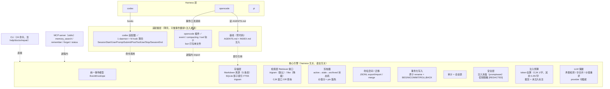
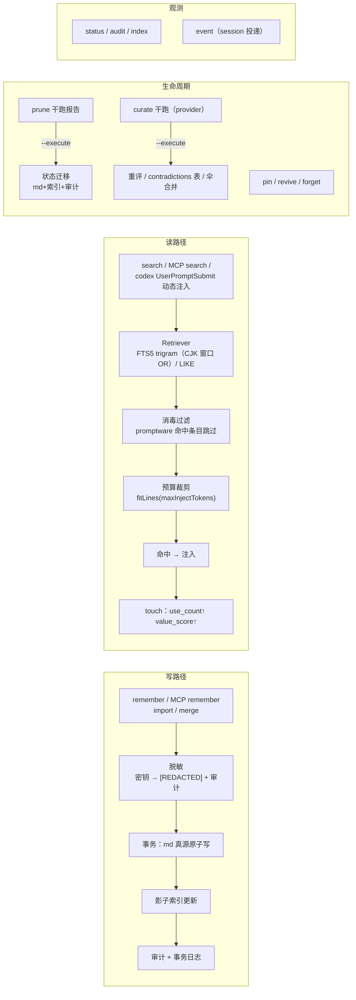

# Memcore 架构现状图

> 2026-08-08 快照：M0–M4 代码完成（真实 harness 验证待启用），LLM 策展骨架就绪。
> 设计文档见 [design.md](./memory-harness-design.md)。

## 1. 分层架构



## 2. 数据流



## 3. 模块地图

```
src/
├── core/
│   ├── events.ts       事件模型（host/event 校验）
│   ├── paths.ts        布局（0700）+ ns 白名单（防穿越）
│   ├── config.ts       config.json（budget/prune/namespace）
│   ├── transaction.ts  原子写（0600+O_EXCL+目录fsync）+ 文件锁（pid/残留回收）+ 事务日志
│   ├── mdStore.ts      真源解析/渲染（§ id | kind | created | status | pinned）
│   ├── sqlite.ts       驱动探测 bun:sqlite → node:sqlite（WAL+busy_timeout）
│   ├── db.ts           影子索引（entries/sessions/contradictions/audit/meta + FTS5）
│   │                   rebuild 保留统计 + schema_version 迁移 + withTransaction（嵌套防护）
│   ├── retriever.ts    Retriever 接口 + trigram/like 后端 + CJK 窗口 OR 查询
│   ├── select.ts       静态 top-N（SQL 排序，排除 archived）
│   ├── prune.ts        剪枝状态机（纯函数）
│   ├── transfer.ts     export/import/merge（ns 校验 + 内容去重 + 脱敏）
│   ├── baseline.ts     INDEX.md + AGENTS.md 区块（预算+消毒+审计）
│   ├── budget.ts       token 估算（CJK=1，其余 0.25）+ 裁剪
│   ├── sanitize.ts     注入扫描（Unicode/中文等价/零宽）+ 密钥脱敏
│   └── curate.ts       LLM 策展（provider 抽象：矛盾/伞合并/重评 + 超时）
├── mcp/index.ts        MCP server（4 工具：检索消毒 + config 默认 ns）
├── cli/index.ts        CLI 入口（24 命令，含 help/doctor/repair）
└── adapters/
    ├── shared/engine.ts  MemcoreAdapter（会话记账/注入/复盘/读侧 touch）
    ├── opencode/plugin.ts opencode 插件（打包单文件）
    └── codex/
        ├── daemon.ts    unix socket daemon（token 首写者胜 + 单实例探测 + chmod600）
        ├── hook.ts      薄壳（token 转发 + stderr/hook.log 诊断）
        └── generate.ts  plugin.json + 全事件 snippet + MCP bundle（dist 入口）
docs/
├── memory-harness-design.md   设计方案（原始调研）
├── architecture.md            本文档
├── integration-opencode.md    opencode 接入说明
└── integration-codex.md       codex 接入说明（协议源码核实）
tests/                          190 用例（19 文件）
```

## 4. 存储布局

```
~/.memcore/
├── memory/
│   ├── <namespace>/
│   │   ├── MEMORY.md      # 事实/决策/约束（§ id | kind | created | status | pinned）
│   │   ├── USER.md        # 偏好
│   │   └── SESSION.md     # 会话复盘（适配器自动落盘）
│   └── INDEX.md           # 全局导航索引（AGENTS.md 引用）
├── index.sqlite           # 影子索引（FTS5 trigram，可重建）
├── config.json            # budget / prune 阈值 / namespace
├── state/
│   ├── transactions.jsonl # 事务日志
│   └── codex.sock         # codex daemon socket（运行时）
└── codex-plugin/          # memcore codex-plugin 默认输出
```

## 5. 里程碑状态

| 里程碑 | 内容 | 状态 |
|---|---|---|
| M0 | 骨架：存储层 + 事务化写入 + CLI | ✅ 完成 |
| M1 | MCP server + AGENTS.md 基线注入 | ✅ 完成 |
| M2 | 剪枝状态机 + pin/revive + JSONL 导入导出 + 合并 | ✅ 完成 |
| M3 | opencode 高集成适配器 | ✅ 代码完成 |
| M4 | codex 适配器（daemon+薄壳+plugin 生成） | ✅ 代码完成 |
| 安全层 | 注入消毒（Unicode/中文等价）+ 密钥脱敏 + 审计 + 文件权限 0700/0600 + socket 鉴权 | ✅ 完成 |
| 注入预算 | token 估算 + 裁剪（全部注入路径） | ✅ 完成 |
| 检索增强 | CJK 4 字符窗口 OR 查询（自然语言提问召回） | ✅ 完成 |
| LLM 策展 | 矛盾检测/伞合并/价值重评（provider 抽象 + 上游脱敏 + 超时） | ✅ 骨架完成（需 API key 实测） |
| 真实 harness 验证 | opencode/codex 实机闭环 | ⏳ 待启用 |
| 官方 memories 镜像 | codex extensions 镜像同步 | ⏳ 延后 |
